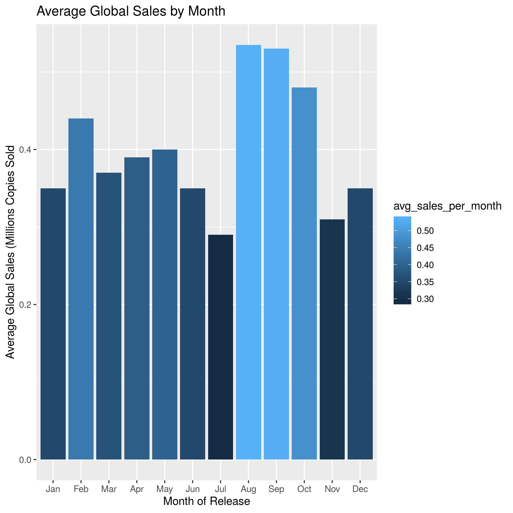

## Introduction

#### Our Dataset

For our final project we decided to work with a dataset found on [Kaggle](https://www.kaggle.com/sidtwr/videogames-sales-dataset#Video_Games_Sales_as_at_22_Dec_2016.csv). This dataset is a list of all video game sales as of December 22, 2016. Our dataset contained the following variables:

- Name : Name of the video game
- Platform : Platform the game was released on
- Year_of_Release : Year the game was released
- Genre : Genre of the video game
- Publisher : Publisher of the video game
- NA_Sales : North American Sales (Millions Copies Sold)
- EU_Sales : European Sales (Millions Copies Sold)
- JP_Sales : Sales in Japan (Millions Copies Sold)
- Other_Sales : Sales in other countries (Millions Copies Sold)
- Global_Sales : Global Sales (Millions Copies Sold)
- Critic_Score : Average critic score out of 100
- Critic_Count : Number of critic reviews
- User_Score : Average user score out of 10
- User_Count : Number of user reviews
- Developer : Developer of the video game
- Rating : The video games censorship rating

#### General Research Questions and Ideas

Using an exploratory data analysis for [application 05](https://github.com/sta518/application05-s01-blue) we developed some ideas and questions on how we would like to analyze this dataset. The ideas were as follows:

1. Could we create a regression to predict global sales using this dataset?
2. Create an RShiny application containing a table with this dataset where you can search the global sales for any video game in the dataset.
3. Create visualizations to show the average global sales by month of release and average global sales by year of release. Are there any trends or abnormalties?
4. Is there a difference in mean global sales for Xbox and Playstation for games which are released on both consoles?

## Data Analysis Plan

#### Regression Analysis

For our regression analysis we decided to include five variables from the dataset. Our response variable is `Global_Sales`. The explanatory variables are `Genre` , `Publisher` , `Rating`, and `Year_of_Release`. Due to the large number of publishers and genres we decided to take the top 5 responses from each variable. Similar to publishers and genres, we only took the top four ratings. The reason for this was to ensure we had a manageable number of coefficients for each of these categories in our final model. Our model building philosophy will be backwards selection and we will keep any variables with at least one significant coefficient.

#### Shiny Application

What we plan to include in our shiny app is:

- Multiple tabs with different sections including each group members contributions
- Tab one will contain multiple selections to bring up sections of this report
- Tab two will have the search table for historical video game sales
- Tab three will have interactive plots
- Tab four will have the visualizations of average global sales by year and by month
- Tab five and six will have information and graphs on our t-test
- Tab seven will have our regression results

#### Visualizations

Each visualization will be a bar chart of average global sales by either year of release or by month of release. From this visualtion we plan to find out what years were the best years for selling video games, and what months are the best months to release video games.

#### t-test

...

## Discussion

#### Regression Analysis

...

#### Visualizations

To start off, we made a bar chart with the year on the x-axis, and the average global sales for that year on the y-axis. This is what it looked like.

Here we can immediatley see an abnormality in our data. From 1980-1990, average global sales spikes up by almost 2 million more than usual. To figure out why this was, we decided to make a scatterplot of each game with the year of release on the x-axis and the global sales on the y-axis. 

From this scatterplot, we can see that there were a lot less games sold between 1980-1990 than there were in later years, and most of those games sold more copies than the average game released in later years. This is what caused the huge spike in our bar chart. Even though it looks like there are a lot more games selling more copies around 2010, there are even more games that are not selling very many copies at all, and this brings the average global sales down tremendously. This tells us that when older games were released, they were more popular because there were not as many options. In present day however, with so many games being released, very rarely is it a big selling game. The game with the highest sales in our data set at around 80 million copies sold is Wii Sports, released in 2006.

Next we made a bar chart with month of release on the x-axis, and the global sales on the y-axis.

Here we can see a few months where the average copies sold increase. These months are February, August, September, and October, with the highest spike between August and October. From this bar chart, it is safe to say that the best month to release a game is sometime around August through October. February is a good month too, but not quite as good as the other months.

#### t-test

...

## Conclusion

While we had the right idea for our regression analysis, our adjusted r squared was really small because our data set was very large, making it hard to predict anything. If we were to continue on this assignment and adjust certain things, instead of using the entire data set given, we could take two samples of our data set, one for training our regression model, and the other for testing it. This would most likely end up giving us a more accurate regression model.

