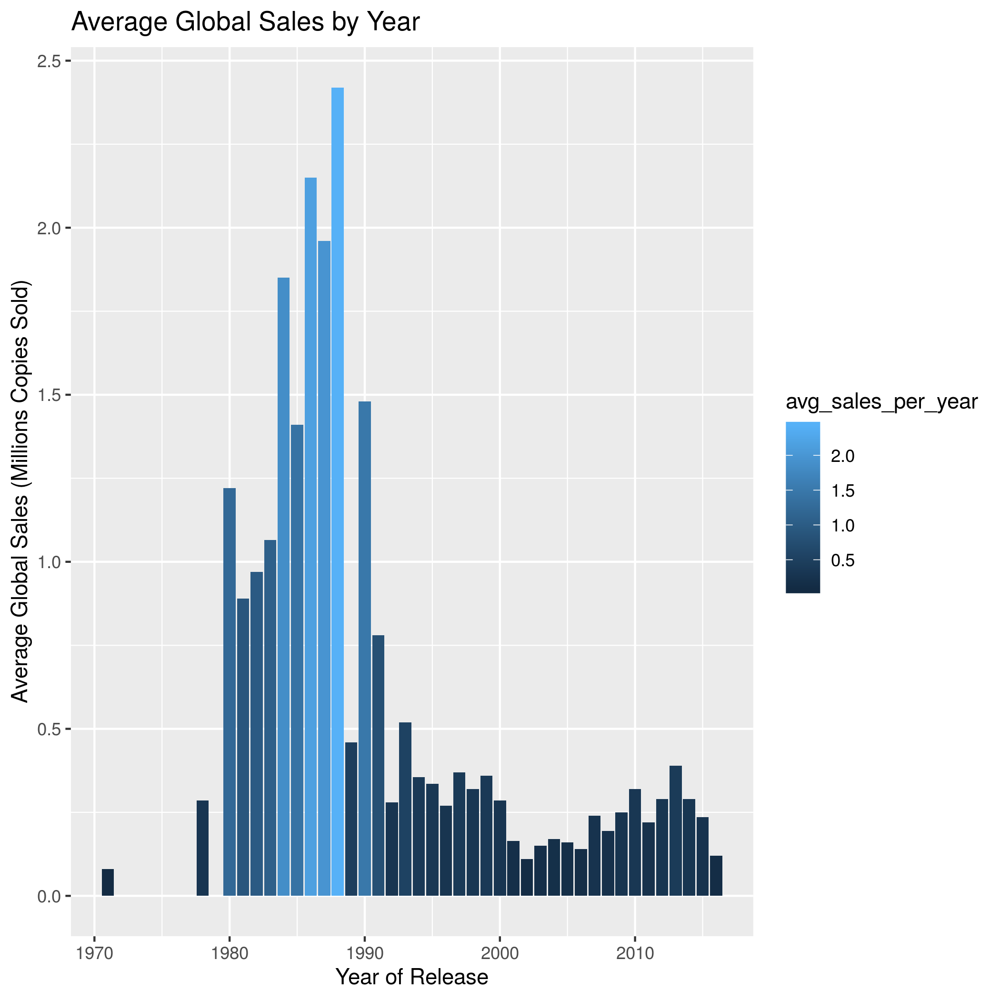

## Introduction

#### Our Dataset

For our final project we decided to work with a dataset found on [Kaggle](https://www.kaggle.com/sidtwr/videogames-sales-dataset#Video_Games_Sales_as_at_22_Dec_2016.csv). This dataset is a list of all video game sales as of December 22, 2016. Our dataset contained the following variables:

- Name : Name of the video game
- Platform : Platform the game was released on
- Year_of_Release : Year the game was released
- Genre : Genre of the video game
- Publisher : Publisher of the video game
- NA_Sales : North American Sales (Millions Copies Sold)
- EU_Sales : European Sales (Millions Copies Sold)
- JP_Sales : Sales in Japan (Millions Copies Sold)
- Other_Sales : Sales in other countries (Millions Copies Sold)
- Global_Sales : Global Sales (Millions Copies Sold)
- Critic_Score : Average critic score out of 100
- Critic_Count : Number of critic reviews
- User_Score : Average user score out of 10
- User_Count : Number of user reviews
- Developer : Developer of the video game
- Rating : The video games censorship rating

#### General Research Questions and Ideas

Using an exploratory data analysis for [application 05](https://github.com/sta518/application05-s01-blue) we developed some ideas and questions on how we would like to analyze this dataset. The ideas were as follows:

1. Could we create a regression to predict global sales using this dataset?
2. Create an RShiny application containing a table with this dataset where you can search the global sales for any video game in the dataset.
3. Create visualizations to show the average global sales by month of release and average global sales by year of release. Are there any trends or abnormalties?
4. Is there a difference in mean global sales for Xbox and Playstation for games which are released on both consoles?

## Data Analysis Plan

#### Regression Analysis


For our regression analysis we decided to include five variables from the dataset. Our response variable is `log(Global_Sales)` because of the heavy right skew in `Global_Sales` shown in the histogram below. The explanatory variables are `Genre` , `Publisher` , `Rating`, and `Year_of_Release`. Due to the large number of publishers and genres we decided to take the top 5 responses from each variable. Similar to publishers and genres, we only took the top four ratings. The reason for this was to ensure we had a manageable number of coefficients for each of these categories in our final model. Our model building philosophy will be backwards selection and we will keep any variables with at least one significant coefficient.

<!-- -->


#### Shiny Application

What we plan to include in our shiny app is:

- Multiple tabs with different sections including each group members contributions
- Tab one will contain multiple selections to bring up sections of this report
- Tab two will have the search table for historical video game sales
- Tab three will have interactive plots
- Tab four will have the visualizations of average global sales by year and by month
- Tab five and six will have information and graphs on our t-test
- Tab seven will have our regression results

#### Visualizations

Each visualization will be a bar chart of average global sales by either year of release or by month of release. From this visualtion we plan to find out what years were the best years for selling video games, and what months are the best months to release video games.

#### T-test

We are interested in the difference in the Global Sales for different consoles. Two of the consoles that we will analyze are all Xbox and Playstation consoles. We want to determine if there is a signifiant differnce in the true mean of global sales for Xbox and Playstation consoles. We plan to check the assumptions for a t-test, and then analyze this question. Our null hypothesis is that there is no significant difference in the true means of global sales for Xbox and Playstation consoles. Our alternative hypothesis is that there is a significant difference in the true means of global sales for Xbox and Playstation consoles.

## Discussion

#### Regression Analysis

As previously mentioned, we are going to model `log(Global_Sales)` as our response variable, and `Genre` , `Publisher` , `Rating`, and `Year_of_Release` as our predictors. We will begin with the full model for our backwards selection.

**Full Model** :

```
## 
## Call:
## lm(formula = log(Global_Sales) ~ Genre + Publisher + Rating + 
##     Year_of_Release, data = regressiondata)
## 
## Residuals:
##     Min      1Q  Median      3Q     Max 
## -3.9943 -0.8359  0.0553  0.8393  3.7028 
## 
## Coefficients:
##                                        Estimate Std. Error t value Pr(>|t|)    
## (Intercept)                           -1.682898   0.207561  -8.108 8.00e-16 ***
## GenreMisc                              0.362296   0.092623   3.912 9.42e-05 ***
## GenreShooter                           0.134020   0.086087   1.557 0.119645    
## GenreSimulation                        0.235471   0.096971   2.428 0.015242 *  
## GenreSports                            0.326588   0.082065   3.980 7.10e-05 ***
## PublisherElectronic Arts               0.307225   0.073145   4.200 2.76e-05 ***
## PublisherKonami Digital Entertainment -0.601679   0.095488  -6.301 3.49e-10 ***
## PublisherNamco Bandai Games           -0.628912   0.127106  -4.948 8.00e-07 ***
## PublisherUbisoft                      -0.296404   0.079871  -3.711 0.000211 ***
## RatingE10+                             0.014930   0.088225   0.169 0.865633    
## RatingM                                0.824773   0.099586   8.282  < 2e-16 ***
## RatingT                                0.173493   0.074689   2.323 0.020267 *  
## Year_of_Release                        0.006682   0.006553   1.020 0.307997    
## ---
## Signif. codes:  0 '***' 0.001 '**' 0.01 '*' 0.05 '.' 0.1 ' ' 1
## 
## Residual standard error: 1.292 on 2478 degrees of freedom
## Multiple R-squared:  0.096,	Adjusted R-squared:  0.09162 
## F-statistic: 21.93 on 12 and 2478 DF,  p-value: < 2.2e-16
```

Due to a p-value of `0.307997`, `Year_of_Release` will be removed from the model.


**Final Model** : 
Global Sales = Genre + Publisher + Rating


```
## 
## Call:
## lm(formula = log(Global_Sales) ~ Genre + Publisher + Rating, 
##     data = regressiondata)
## 
## Residuals:
##     Min      1Q  Median      3Q     Max 
## -3.9614 -0.8383  0.0544  0.8386  3.7045 
## 
## Coefficients:
##                                       Estimate Std. Error t value Pr(>|t|)    
## (Intercept)                           -1.49121    0.08797 -16.951  < 2e-16 ***
## GenreMisc                              0.36951    0.09235   4.001 6.49e-05 ***
## GenreShooter                           0.12849    0.08592   1.496 0.134902    
## GenreSimulation                        0.23322    0.09695   2.406 0.016216 *  
## GenreSports                            0.32552    0.08206   3.967 7.49e-05 ***
## PublisherElectronic Arts               0.30494    0.07311   4.171 3.14e-05 ***
## PublisherKonami Digital Entertainment -0.60853    0.09525  -6.389 1.99e-10 ***
## PublisherNamco Bandai Games           -0.62320    0.12698  -4.908 9.81e-07 ***
## PublisherUbisoft                      -0.29519    0.07986  -3.696 0.000224 ***
## RatingE10+                             0.02693    0.08744   0.308 0.758148    
## RatingM                                0.84088    0.09833   8.552  < 2e-16 ***
## RatingT                                0.17301    0.07469   2.316 0.020619 *  
## ---
## Signif. codes:  0 '***' 0.001 '**' 0.01 '*' 0.05 '.' 0.1 ' ' 1
## 
## Residual standard error: 1.292 on 2479 degrees of freedom
## Multiple R-squared:  0.09562,	Adjusted R-squared:  0.09161 
## F-statistic: 23.83 on 11 and 2479 DF,  p-value: < 2.2e-16
```

While all of our variables in our model were significant, an adjusted r-squared value of `0.09161` is not good. This tells us our model explains `9.161%` of the variation in `Global Sales`. While this is not surprising considering there are many potential factors which affect `Global Sales` and we have a large sample size of `2,491` observations; our model cannot reliably predict `Global Sales`.

#### Visualizations

To start off, we made a bar chart with the year on the x-axis, and the average global sales for that year on the y-axis. This is what it looked like.



Here we can immediatley see an abnormality in our data. From 1980-1990, average global sales spikes up by almost 2 million more than usual. To figure out why this was, we decided to make a scatterplot of each game with the year of release on the x-axis and the global sales on the y-axis. 


From this scatterplot, we can see that there were a lot less games sold between 1980-1990 than there were in later years, and most of those games sold more copies than the average game released in later years. This is what caused the huge spike in our bar chart. Even though it looks like there are a lot more games selling more copies around 2010, there are even more games that are not selling very many copies at all, and this brings the average global sales down tremendously. This tells us that when older games were released, they were more popular because there were not as many options. In present day however, with so many games being released, very rarely is it a big selling game. The game with the highest sales in our data set at around 80 million copies sold is Wii Sports, released in 2006.

Next we made a bar chart with month of release on the x-axis, and the global sales on the y-axis.


Here we can see a few months where the average copies sold increase. These months are February, August, September, and October, with the highest spike between August and October. From this bar chart, it is safe to say that the best month to release a game is sometime around August through October. February is a good month too, but not quite as good as the other months.

#### T-test

The total sample sizes for the two groups, Xbox and Playstation consoles, are as followed: 2333 Xbox observations and 6723 Playstation observations. We are interested in the variable global sales, and whether there is a true mean difference in the means of global sales for these two consoles. First, we will check the assumptions of normality and constant variance.

<!-- -->

Looking at the box plots of the distribution we can see that there our multiple outliers for both systems. Since our sample sizes are high for both groups, these outliers may not be influential in the normality of the data. Our sample size is practically the populations of Xbox and Playstation games. Thus, we can assume normality in the data and can continue with the analysis. A F test was run to check the variance of the plots to see if they are equal. The test yeilded an F test statistic of 0.74071, and a p-value of < 2.2e-16. This says that the variances of the two distributions are unequal, so we will continue with a t-test that has unequal variances. 


```
## 
## 	F test to compare two variances
## 
## data:  Global_Sales by System
## F = 0.74071, num df = 6722, denom df = 2332, p-value < 2.2e-16
## alternative hypothesis: true ratio of variances is not equal to 1
## 95 percent confidence interval:
##  0.6925888 0.7913113
## sample estimates:
## ratio of variances 
##          0.7407102
```

```
## 
## 	Welch Two Sample t-test
## 
## data:  xbox.test and playstation.test
## t = 2.0591, df = 3602.3, p-value = 0.03956
## alternative hypothesis: true difference in means is not equal to 0
## 95 percent confidence interval:
##  0.00295317 0.12057163
## sample estimates:
## mean of x mean of y 
## 0.5955122 0.5337498
```

The t-test yields a t test statistic of 2.0591 and a p-value of 0.03956. This is a significant p-value at an alpha = 0.05 level. Thus, there is a significant difference of the means of the global sales for xbox and playstation consoles. The mean global sales of the xbox console (0.5955122) was significantly higher than the mean global sales of the playstation console (0.5337498). We can conclude that the mean global sales of Xbox consoles is significantly higher than the mean global sales for Playstation consoles.

## Conclusion

Our methods used in our statistical analysis could be improved in a number of ways. First, in our regression we could take two subsets of our data as a training dataset and test dataset. The training set would have less observations and possibly provide a more reliable prediction. Using the model created, we could then test the model on our test dataset to obtain an estimate on how predictive our model is. A second way we could improve our regression analysis is by using different explanatory variables. Due to the large number of publishers and genres, we only used the top five from each category. If we had used user score and critic score instead, we may have had better results. Much like our regression, our t-test had a sample size which was way too large to tell us anything of importance. Although it is worth noting our dataset contained close to the population, if not the entire population, of games released on both Xbox and Playstation. This would negate the need for the t-test as we don't need to infer anything about our population, we are simply describing differences between the two populations.


